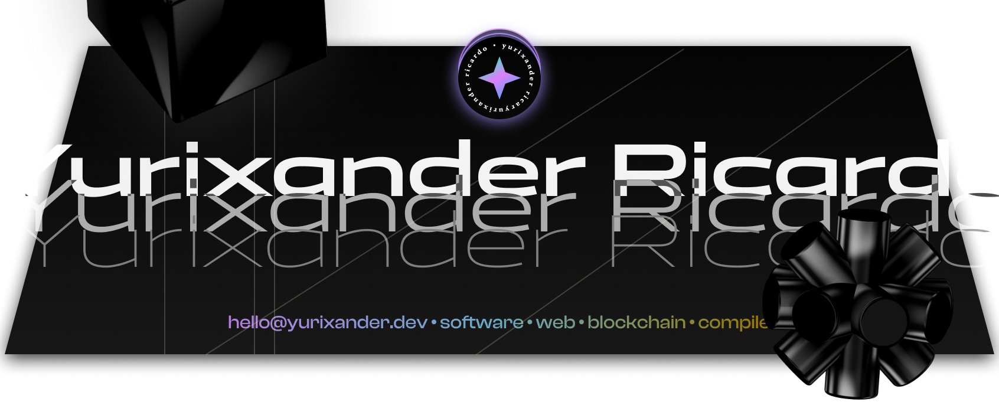

#### 🛠 Skills & technologies
- **Proficient in**: Rust, TypeScript, JavaScript, C/C++.
- **Specialized in**: Software engineering, compilers & developer tooling, functional programming.
- **Familiar with**: Git, SQL & MongoDB, unit-testing, end-to-end (E2E) tests, debugging (LLDB, breakpoints).
- Strong focus on writing simple, high-quality, clean, and readable code.
- Emphasis on efficient code by utilizing proper data structures and algorithms.

#### 🏆 Achievements
- Independently designed and implemented 50+ professional business websites, achieving a 90%+ client satisfaction rate.
- Worked as a full-stack software engineer (internship & full-time), directly delivering successful project revisions to over 100 businesses.
- Built my own compiler in Rust with advanced features like Hindley-Milner's type inference algorithm, parametric polymorphism (generics), closures, and more.

#### 🚴‍♂️ Hobbies & personal interests
- Cycling and game development.
- Chess & strategy games.
- Animals, nature, pets.
- Learning about anything engineering-related (physics, mathematics, etc.).

🤝 **I am currently open to work**: If you have a challenging opportunity, I would love to work with you!
